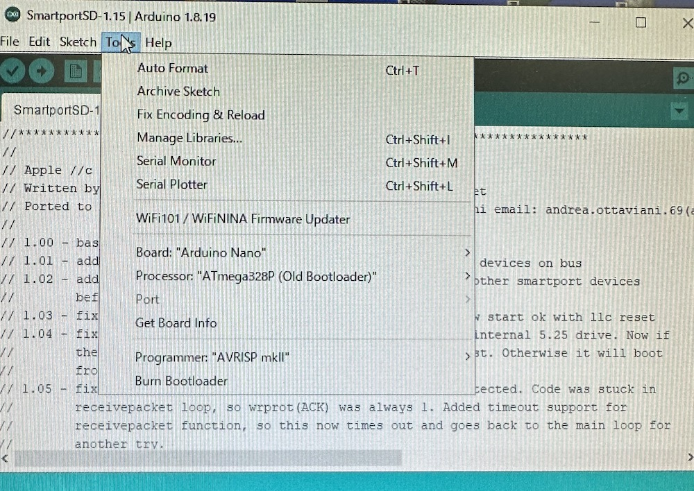
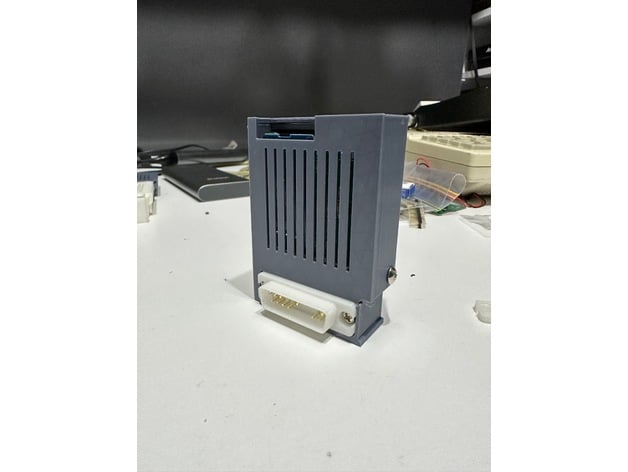
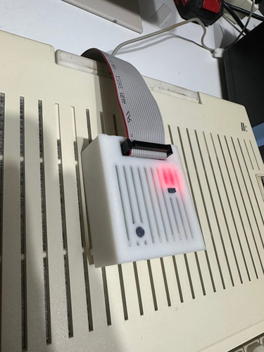

# SPIISD DIY KIT

 

# What is SPIISD ?
It is based on an open source project called SmartPortSD. 
Created by Australian genius [Robert Justice](https://web.archive.org/web/20230222233834/http://www.users.on.net/~rjustice/SmartportCFA/SmartportCFA.htm), SmartPortCFA was ported to Arduino hardware by Italian programmer genius [Andrea Ottaviani](https://github.com/aotta?fbclid=IwAR0_7cMKVhMVrHznB9bIub9ZmrmBlwAM3p6-_CQd0JFW1o736nUNZHyuTdw).  to porting to Arduino hardware. It was improved upon by [Katherine Stark](https://gitlab.com/nyankat/smartportsd) of Canada. She made available its ability to access four ProDOS-formatted 32MB PO files stored on a FAT32-formatted SD card. When she did this successfully, many wanted to build it.

*Got permission from the three geniuses I introduced earlier.  

We differentiated it with a name to distinguish it from other SmartportSD hardware (including unlicensed ones).  

 
More details here (My Blog):
https://ameblo.jp/keroxiee1016/entry-12819341808.html

## Flashing Arduino Nano

Oct 15th, 2024: SmartportSD program has been updated to Ver.1.17, version 1.17 has been thoroughly tested with "SPIISD" hardware and has confirmed good performance. Fixed a problem with the Apple IIcPlus, and improved versatility with slower SD cards. Usage is the same as V.1.16.

May 8th, 2024: SmartportSD program has been updated to Ver.1.16 by Wing Yeung from [MFA2 work shop](http://www.mfa2lab.com). version 1.16 has been thoroughly tested with "SPIISD" hardware and has confirmed good performance. This same 1.16 program can work with both "SPIISD DIY KIT" and "SPIISD MINI". *We have not verified SmartportSD compatible devices from other manufacturers. I think they work well if they keep the same schematics. 

- By placing "config.txt" at the root of the SD card, you can place various files without renaming them. 
- Write 4x file names in "config.txt". SPIISD will only read files with that filename.
In addition to ".po", ".hdv" and ".2mg" can be used as extensions. 
- Of course, you can put an unlimited number of images in the root of the SD card, but only the config.txt file will be read. 
- If you do not place config.txt, you can also place four files from PART1.po as before. 

You can flash your Arduino Nano via ArduinoIDE. Please download and use firmware of ["SmartportSD-1.17" folder](SmartportSD-1.17). If a new folder is created when using the Arduino IDE, please re-insert all the contents of this "SmartportSD-1.17" folder into the new folder. *The name of the ".ino" file should always be the same as the parent folder, so there is usually no problem if you use it as is. 
 
The Nano board you should choose is MEGA328P. Please do not buy MEGA168P as it has 38% insufficient capacity and cannot be flashed. 
 
The Arduino IDE settings are as follows, 
Board: "Arduino Nano" 
Processor: "ATmega328P(Old Bootloader)" 
Port: Number of USB port connected to Arduino Nano *In your PC 
Programmer: "AVRISP mkII" 

## Assemble
Uploaded on Sep 24, assembly instructions can be found [here](SP2SD_DIY_INST.pdf), You can see which parts should be attached where by looking at our [BOM](SP2SD_NANO_DIY_BOM.csv). 
 

 
The IDC20 connector can be oriented in various ways depending on how you use it, When installing the male IDC20pin connector, be sure to make sure that the part is on the top side. When stacking two PCBs, make sure the hole and ▼ are in the same position. In that case, match the IDC20pin male and female connectors or connect them with a 2X10 pin header.  
日本語の組み立て説明書は[こちら](SP2SD_DIY_INST_JPN.pdf)から

## DB19 male connector

You can 3D print the base material and pull out the pins from a [DB25 male connector](https://www.amazon.com/PC-Accessories-Connectors-Connector-25-PACK/dp/B073KR622F/ref=sr_1_2_sspa?crid=2ZCRZ8PNIBJ4R&keywords=DB25+connector+male&qid=1693987417&sprefix=db25+connector+mal%2Caps%2C398&sr=8-2-spons&sp_csd=d2lkZ2V0TmFtZT1zcF9hdGY&psc=1) and insert them, or purchase new pins from [AliExpress](https://www.aliexpress.com/item/1005002617586407.html?spm=a2g0o.order_list.order_list_main.16.55d11802jCHaOW). We have omitted unnecessary pins to make it simple for you to create. I will give out free .STL files that can be 3D printed.    DB19 connector file is [this](KEROS_DB19_V1.zip).

## 3D printed shell case

Our awesome friend [Mr Lurch](https://www.youtube.com/channel/UCMQ28v823w6p1ZnyiZDVwUg) completed the shell case design. This can be used by connecting boards A and B with pin headers without using cables.  
 [Here](https://www.thingiverse.com/thing:6235981) is the case stl files for integrated. 
 [Here](https://www.thingiverse.com/thing:6248598) is the case stl files for cable connection.

## Supported Apple II computers

 

  
- Apple IIgs　*Even you set the startup slot to #5 and remove other bootable devices the startup timing does not match, try the shortcut key "Open Apple" + "Control" + "Reset" to reboot. If you are new to IIgs, make sure to release key "Open Apple"　 last and it will reboot easily. 
- Apple IIc, IIc Plus *In the case of IIc, Smartport cannot be used as is with older ROM 255, so a ROM upgrade is required. See the chapter bellow
- Apple IIe, IIe Enhanced, IIe Platinum, works well with Grappler Minus card (1) with SoftSP diy ROM V2, V3 and V6-a. It works into the #5 slot and use it via the DiskII card in the #6 slot. In other words, it is a card that connects SmartPort with two cards. *You can also use it via "Liron" card, BMOW also has a highly functional card called "Yellowstone", which can also be used.  
- Apple II Plus, works well with GrapplerMinus card with SoftSP diy ROM V2, V3 and V6-a. 

(1) We developed the [Grappler Minus card](https://github.com/kerokero5150/GrapplerMinus/blob/main/README.md), which overcomes timing issues. This is also open source and anyone can create it, but it is not allowed to be sold. It is also available for purchase at our store.   
If you use SoftSP with the Genuine "Grappler Plus" card, the functionality of SoftSP DIY will be limited due to the unnecessary circuitry of the printer interface. Specifically, it only works with Apple IIe, and only V2 and V3 ROMs can be used.

## Usage
 
Use a FAT32(16) formatted MicroSD card. Most of the MicroSD cards currently on sale can be used as is.
Extension .po files can be used.  
The Apple ProDOS disk image that can be used for SPIISD is a .PO file with a maximum size of 32MB. Place this file at the root of your micro SD card. Up to 4 files can be recognized. The first file name should be “PART1.PO”. As you can imagine, there can place four files, so from the second file on, name the files with regularity, such as "PART2.PO", "PART3.PO", and "PART4.PO". 
For disk images with the .hdv extension, the catalog structure is the same, so you should be able to use them by simply renaming the file to .po. An APP called CiderPressV4 can convert other file extensions to .po.  
I think the most popular way to use SPIISD on the IIc is to use TotalReplay, a collection of old appleII games.  
The IIgs supports GSOS. In this case, you can check all four files at the same time on the OS's finder. If you only have a IIgs, the SPIISD is the device with the best value for money.  
*If you change the extension from .hdv to .po and it doesn't work, you can use CiderPress to convert it to a .PO file. CiderPressV4 can be done on Windows 7 and up. *For Win98/ME/2K/XP there is an older version. 
 
CiderPress V4: (https://a2ciderpress.com)  
TotalReplay: (https://archive.org/details/TotalReplay)  
 

## To use Apple IIc's smart port
For Apple IIc, Smartport will not be enabled if ROM 255 is installed(Probably ROM0 as well). To check the ROM of your IIc, run the following program from the Basic prompt.
  PRINT PEEK (64447)
If the output number is "255", the ROM needs to be replaced. The ROM versions that Smartport can use are "3", "4" and ROM"4x". For these numbers, ROM replacement is not necessary.

The replaced ROMs are available [here](https://mirrors.apple2.org.za/Apple%20II%20Documentation%20Project/Computers/Apple%20II/Apple%20IIc/ROM%20Images/).
There is also the useful hacked [ROM4X](https://github.com/mgcaret/rom4x). This is a fairly new ROM updated in 2018.  

My recommendation is ROM4X. 

If you want to swap the ROM from 255 to another ROM, you need to change the solder jumpers "W1" and "W2". 
255 is 16KB while other ROMs are 32KB. Enable 32KB by changing Pin27, which is A14, from pull-down to pull-up. 
See below for solder jumper locations. [External site](https://www.apple2faq.com/apple2faq/apple-iic-rom-upgrade/?fbclid=IwAR3BZfkTRkhG0zg6dHxvxYdH9SbyCvsA-Zr1-_e0wyenW6WFG-cKSsxj_oM)

## To get the SPIISD PCB

You can use [SPSD_DIY_NANO_GERBER.zip](SPSD_DIY_NANO_GERBER.zip)  and uploading it to JLCPCB or PCBWAY as it is.

 

The [SPIISD DIY kit](https://en.infinityproducts.co.jp/product-page/sp2sd-diykit-bare-pcb-board-a-b) comes complete with all parts, sold in our [store](https://en.infinityproducts.co.jp/shop-1). [SPIISD mini](https://en.infinityproducts.co.jp/product-page/spiisd-mini-for-iic-iicplus-iigs) is a compact hardware with fixed db19. It does not require assembly, so it is recommended for those who want to use it immediately, and for those who want a sense of unity with Apple IIc.

## Licenses

SmartportSD software licenses are listed [here](SMARTPORTSD_LICENSE.md) under the MIT license.
Ⓒ2023 Katherine Stark, Robert Justice, Andrea Ottaviani. All rights reserved.

This SPIISD hardware is licensed under a
[Creative Commons Attribution-ShareAlike 4.0 International License](https://creativecommons.org/licenses/by-nc-sa/4.0/).
Ⓒ 2023 Kay Koba, Kero's mac Mods, All rights reserved.

