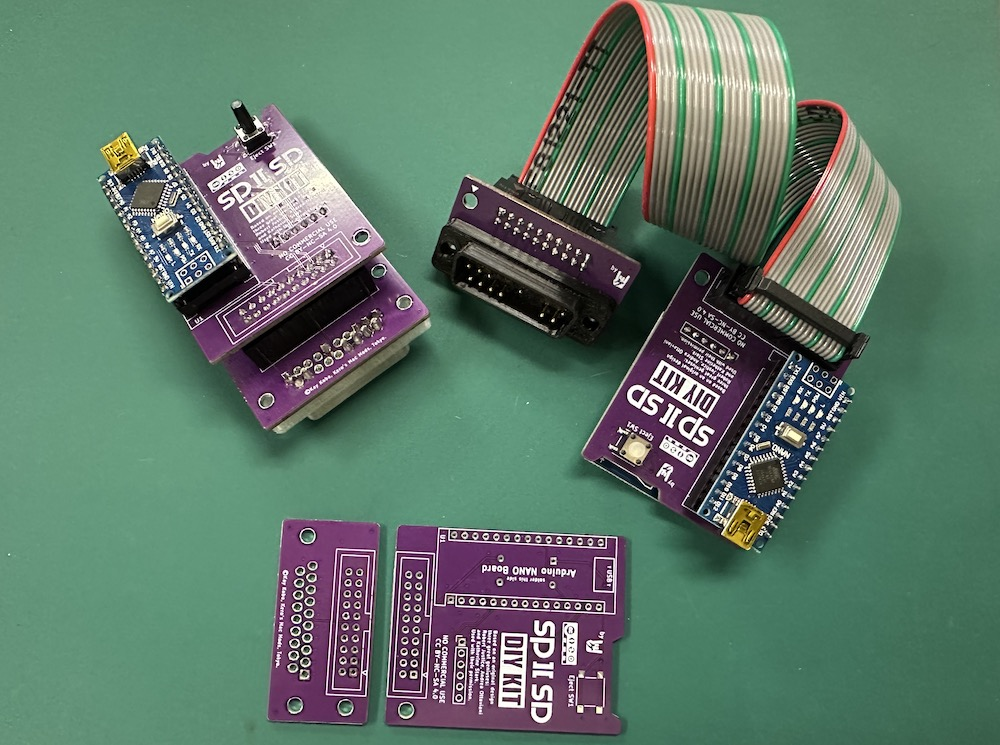
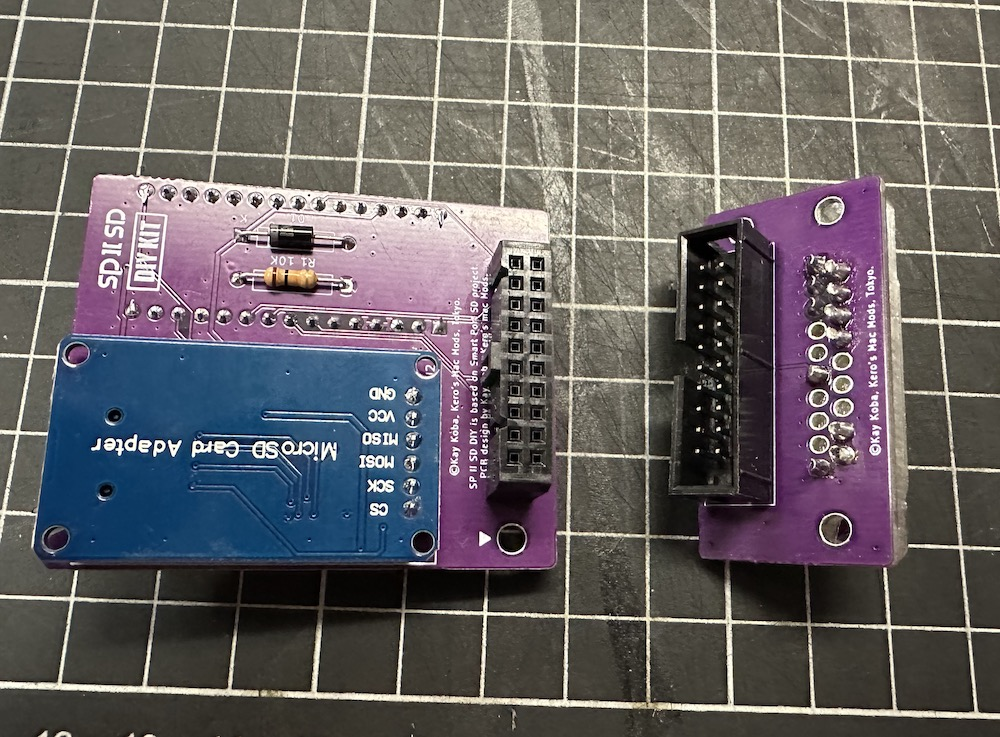
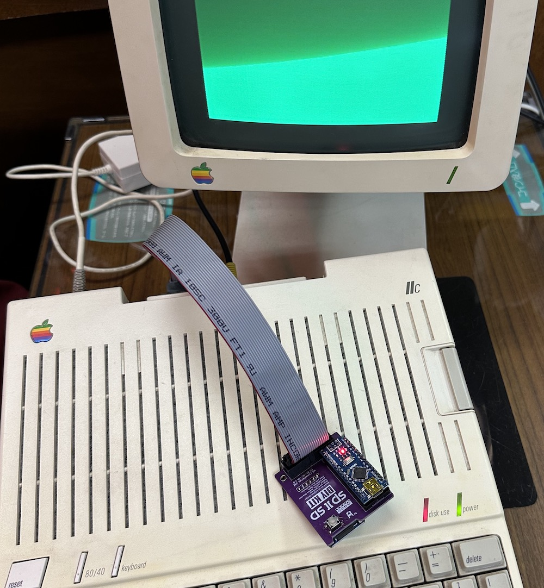
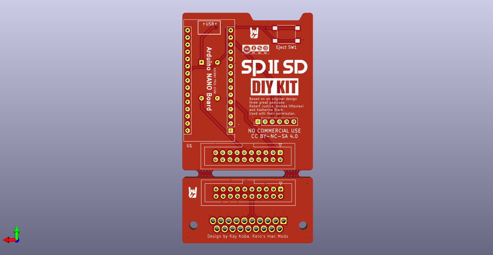

# SP2SD_DIY_KIT

 

# What kind of product is this
It is based on an open source project called SmartPortSD. 
Created by Australian genius [Robert Justice](https://web.archive.org/web/20230222233834/http://www.users.on.net/~rjustice/SmartportCFA/SmartportCFA.htm), SmartPortCFA was ported to Arduino hardware by Italian programmer genius [Andrea Ottaviani](https://github.com/aotta?fbclid=IwAR0_7cMKVhMVrHznB9bIub9ZmrmBlwAM3p6-_CQd0JFW1o736nUNZHyuTdw).  to porting to Arduino hardware. It was improved upon by [Katherine Stark](https://gitlab.com/nyankat/smartportsd) of Canada. She made available its ability to access four ProDOS-formatted 32MB PO files stored on a FAT32-formatted SD card. When she did this successfully, many wanted to build it.

*Got permission from the three geniuses I introduced earlier.

 
More details here (My Blog):
https://ameblo.jp/keroxiee1016/entry-12819341808.html
 
## Assemble

Under constructions, You can see which parts should be attached where by looking at our [BOM](SP2SD_NANO_DIY_BOM.csv). The diode has polarity, so match the line and K. Flip the MicroSD board face down and either straighten the right angle pin headers or replace them with vertical pin headers.
 

 
The IDC20 connector can be oriented in various ways depending on how you use it, When installing the male IDC20pin connector, be sure to make sure that the part is on the top side. When stacking two PCBs, make sure the hole and ▼ are in the same position. In that case, match the IDC20pin male and female connectors or connect them with a 2X10 pin header.

## DB19 male connector

You can 3D print the base material and pull out the pins from a [DB25 male connector](https://www.amazon.com/PC-Accessories-Connectors-Connector-25-PACK/dp/B073KR622F/ref=sr_1_2_sspa?crid=2ZCRZ8PNIBJ4R&keywords=DB25+connector+male&qid=1693987417&sprefix=db25+connector+mal%2Caps%2C398&sr=8-2-spons&sp_csd=d2lkZ2V0TmFtZT1zcF9hdGY&psc=1) and insert them, or purchase new pins from [AliExpress](https://www.aliexpress.com/item/1005002617586407.html?spm=a2g0o.order_list.order_list_main.16.55d11802jCHaOW). We have omitted unnecessary pins to make it simple for you to create. I will give out free .STL files that can be 3D printed. DB19 connector file is [this](KEROS_DB19_V1.zip).

## Supported AppleIIs

 

  
Apple IIc, IIgs. For Apple IIe, you can use it via Liron card.

## Gerber files

You can use it by compressing [SPSD_DIY_NANO_GERBER.zip](SPSD_DIY_NANO_GERBER.zip)  and uploading it to JLCPCB as it is.

 

## License

This work is licensed under a
[Creative Commons Attribution-ShareAlike 4.0 International License](https://creativecommons.org/licenses/by-nc-sa/4.0/).
